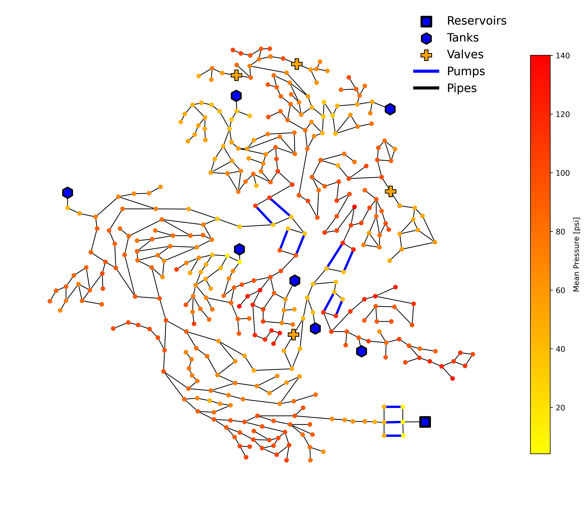
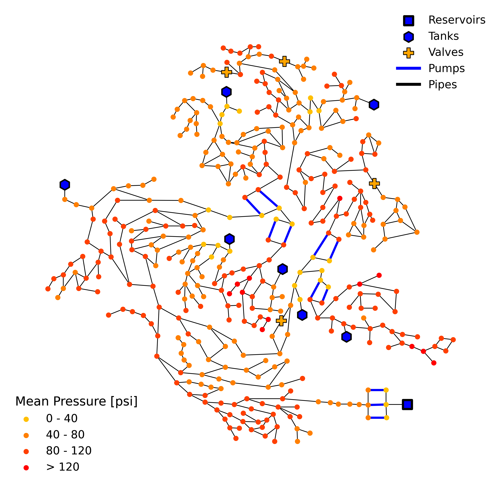

.. image:: https://github.com/tylertrimble/viswaternet/blob/main/logo/viswaternet_logo.png?raw=true
		:target: https://github.com/tylertrimble/viswaternet/blob/main/logo/viswaternet_logo.png?raw=true

.. image:: https://img.shields.io/pypi/v/viswaternet.svg
        :target: https://pypi.python.org/pypi/viswaternet

.. image:: https://readthedocs.org/projects/viswaternet/badge/?version=latest
        :target: https://viswaternet.readthedocs.io/en/latest/
        :alt: Documentation Status

.. image:: https://img.shields.io/pypi/l/ansicolortags.svg
        :target: https://pypi.python.org/pypi/ansicolortags/

An open-source Python package for easy generation and customization of water distribution network visualizations. Find the `documentation here`_.

.. _`documentation here`: https://viswaternet.readthedocs.io

Dependencies
------------
◉ WNTR <0.5.0 ◉ NetworkX 2.7+ ◉ Matplotlib 3.5.0+ ◉ Pandas ◉ NumPy ◉ imageio ◉

VisWaterNet has been tested on Python **3.8** and **3.9**.

Features
--------
VisWaterNet is designed to plot simulation data onto a network graph, with a large variety of customization options available. The package includes the capabilities to:

* Discretize network or simulation data.
* Visualize discretized or continuous data on network graphs.
* Import data from excel files or data generated with Python.
* Create GIFs of data across simulation timesteps.
* Customize style of virtually every element of the network graph, including: reservoirs, tanks, valves, pumps, links, and nodes.
* Draw labels relative to nodes or based on an absolute position on the figure.
* Draw specific nodes or links with their own data and style.

Installation
---------------
To install VisWaterNet, run this command in your terminal:

.. code:: python

    pip install viswaternet
    
Alternatively, the sources for VisWaterNet can be downloaded from the Github repo. You can clone the public repository:

.. code:: python

    git clone git://github.com/tylertrimble/viswaternet

Once you have a copy of the source, you can install it with:

.. code:: python

    python setup.py install

Getting Started
---------------
To get started, import the VisWaterNet package:

.. code:: python

    import viswaternet as vis
    
Next, initialize a VisWaterNet model. For example purposes, we use the CTown network from `Ostfeld (2016)`_ included in the Examples folder:

.. code:: python

    model = vis.VisWNModel('Networks/CTown.inp')

.. _`Ostfeld (2016)`: https://uknowledge.uky.edu/wdst_models/2/
    
Then, call on any of the plotting functions with the argument inputs of your choice. For example, the following line of code displays the network layout of CTown with each node colored according its mean pressure (in *psi*). This is a **continuous** node plot, where the nodal colors are assigned based a gradient scale:

.. code:: python

    model.plot_continuous_nodes(parameter="pressure", value='mean', unit="psi")
    

We can represent the same data in a different way by generating a **discrete** node plot in which mean pressure data is grouped into 4 discrete intervals and node colors are assigned based on the corresponding value shown on a legend:

.. code:: python

    model.plot_discrete_nodes(parameter="pressure", value='mean', unit="psi",
                              legend_loc_2 = 'lower left', intervals = [0,40,80,120],
                              legend_sig_figs =0)

If the plot does not show up after you run the script, it is possible that your IDE does not support interactive plotting (e.g., IDLE) or interactive mode is off. To see the plot, add the following line to display the figures: 

.. code:: python

    plt.show()

Since several VisWaterNet function arguments rely on Matplotlib visualization inputs, it is recommended to visit the `Matplotlib docs`_ to view customization options for `colors`_, `colorbars`_, `node markers`_, `line styles`_, etc.

.. _`Matplotlib docs`: https://matplotlib.org/stable/index.html
.. _`colors`: https://matplotlib.org/stable/gallery/color/named_colors.html
.. _`colorbars`: https://matplotlib.org/stable/tutorials/colors/colormaps.html#sphx-glr-tutorials-colors-colormaps-py
.. _`node markers`: https://matplotlib.org/stable/gallery/lines_bars_and_markers/marker_reference.html
.. _`line styles`: https://matplotlib.org/stable/gallery/lines_bars_and_markers/linestyles.html

More examples that demonstrate the range of VisWaterNet's plotting abilities can be found in the `Example Applications`_ section of the docs.

.. _`Example Applications`: https://viswaternet.readthedocs.io/en/latest/examples.html

Contributing
------------
We welcome contributions in the form of suggestions, feedback, reports of bugs, and additions to code functionality and documentation from all users! You can find instructions to raise issues, submit pull requests, and `run automated tests`_ in the `docs`_ or the `CONTRIBUTING page`_.

.. _`CONTRIBUTING page`: https://github.com/tylertrimble/viswaternet/blob/main/CONTRIBUTING.rst
.. _`docs`: https://viswaternet.readthedocs.io/en/latest/contributing.html
.. _`run automated tests`: https://viswaternet.readthedocs.io/en/latest/contributing.html#testing

Contact
-------
Tyler Trimble - tylerl.trimble@utexas.edu

Meghna Thomas - meghnathomas@utexas.edu

Lina Sela - linasela@utexas.edu

Credits
-------

This package was created with Cookiecutter_ and the `audreyr/cookiecutter-pypackage`_ project template.

.. _Cookiecutter: https://github.com/audreyr/cookiecutter
.. _`audreyr/cookiecutter-pypackage`: https://github.com/audreyr/cookiecutter-pypackage
