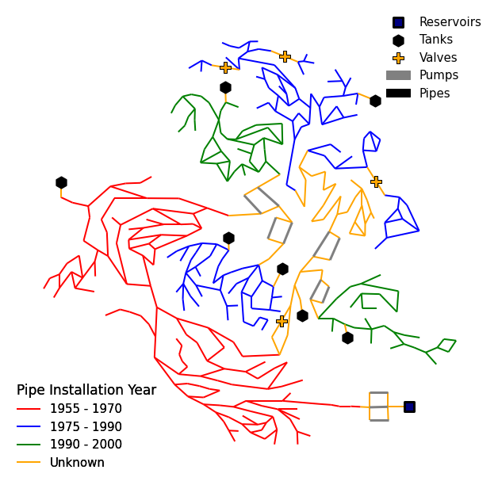
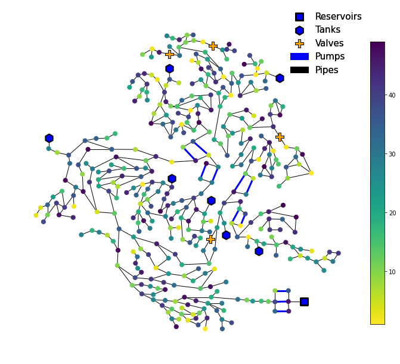
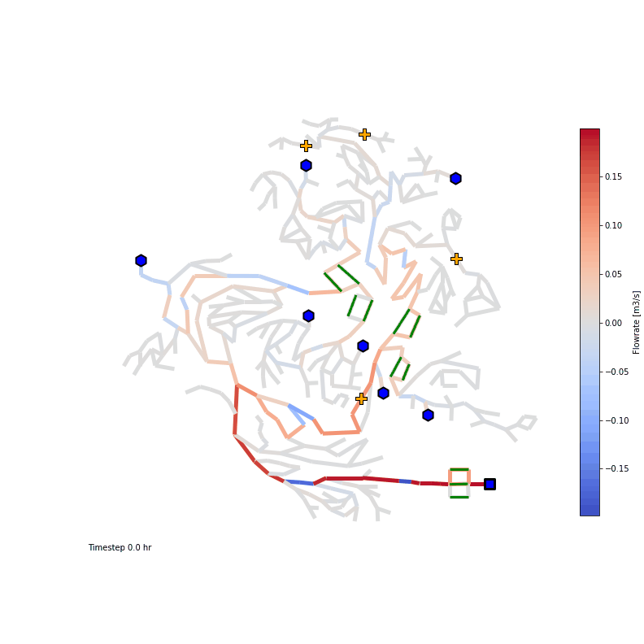

====================
Example Applications
====================

All VisWaterNet scripts should begin with the following three steps:

1.  Import the VisWaterNet and matplotlib.pyplot packages.

.. code:: python

    import viswaternet as vis
    import matplotlib.pyplot as plt
    
2. Initialize a VisWaterNet model object for the .INP file of the water distribution network. For these examples, we use the CTown network model introduced by `Ostfeld (2016)`_.

.. _`Ostfeld (2016)`: https://uknowledge.uky.edu/wdst_models/2/

.. code:: python

    model = vis.VisWNModel("CTown.inp")
    
Alternatively, we can initialize a VisWaterNet model corresponding to a `WNTR`_ water network model object.

.. _`WNTR`: https://www.osti.gov/biblio/1376816

3. Initialize and customize a Matplotlib figure and axis.

.. code:: python

    fig, ax = plt.subplots(figsize=(11,11))  
    ax.set_frame_on(False) # remove frame from figure
    
After we have initialized our VisWaterNet model object and empty matplotlib figure, we can proceed to call on different functions offered by the VisWaterNet library to generate a variety of figures. Below, we provide a series of examples to highlight the different VisWaterNet plotting functions and their wide range of inputs.

Example 1 - Basic Network Layout Plot
-----------------------------

This example demonstrates the basic plotting functionality provided by VisWaterNet. The ``plot_basic_elements`` function is used to generate a view of the network layout, depicting the locations of nodes (junctions, tanks, and reservoirs) and links (pipes, pumps, and valves).

.. code:: python

    model.plot_basic_elements(ax)

.. _basic1:
.. figure:: figures/eg_plot_1.png
   :width: 600
   :alt: Basic network layout

Example 2 - Customizing a Basic Network Layout Plot
-----------------------------

Here, we customize the **basic** network plot by changing the location of the legend, color of the tank marker, and pump line style.

.. code:: python

    model.plot_basic_elements(ax, legend_loc = 'upper left', 
                              tank_color = 'g', pump_line_style = ':')

.. _basic2:
.. figure:: figures/eg_plot_2.png
   :width: 600
   :alt: Basic network layout modified

All customization inputs can be found `here`_.

.. _`here`: https://viswaternet.readthedocs.io/en/latest/source/viswaternet.drawing.html#viswaternet.drawing.base.draw_base_elements

Next, Examples 3 and 4 demonstrate how to visualize data in a continuous manner, i.e., by assigning colors according to a color bar (or gradient scale).

Example 3 - Continuous Node Data Plot for Nodal Pressure
-----------------------------
 
Here, we create a **continuous** data plot for **nodal pressure at hour 10**.

.. code:: python

    model.plot_continuous_nodes(ax, parameter = "pressure", value = 10)
    
.. _basic3:
.. figure:: figures/eg_plot_3.png
   :width: 600
   :alt: Continuous node plot

Example 4 - Continuous Data Plot for Link Flow Rate
-----------------------------

Here, we create a **continuous** data plot for mean **link flow rate** over the simulation duration. We change the color map from the default 'autumn_r' to 'coolwarm' and vary the width of the links (between *min_width* and *max_width*) according to the link flow rate values.

.. code:: python

    model.plot_continuous_links(ax, parameter = "flowrate", value = 'mean', cmap = 'coolwarm', min_width = 2, max_width = 6)

.. _basic4:
.. figure:: figures/eg_plot_4.png
   :width: 600
   :alt: Continuous link plot

Next we demonstrate how to visualize data in a discrete manner, i.e., by grouping data into intervals and assigning colors according to each interval shown in a legend.

Example 5 - Discrete Data Plot for Nodal Demand
-----------------------------
 
Here, we create a **discrete** data plot for **nodal demand at hour 10**. We specify that we want 3 data intervals, change the location of the discrete data legend, and modify the units of the nodal demand from the default flow units (m3/s, following SI convention) to cubic meter per hour (CMH). `This`_ is a list of the unit conversion options offered by VisWaterNet.

.. _`This`: https://viswaternet.readthedocs.io/en/latest/source/viswaternet.utils.html#module-viswaternet.utils.unit_conversion

.. code:: python

    model.plot_discrete_nodes(ax, parameter = "demand", value = 10, num_intervals = 3, 
                              legend_loc_2 = 'upper left', unit = 'CMH')
    
.. _basic5:
.. figure:: figures/eg_plot_5.png
   :width: 600
   :alt: Discrete node plot

Example 6 - Discrete Data Plot for Link Velocity
-----------------------------

Here, we create a **discrete** data plot for **maximum link velocity** over the simulation duration. We specify the intervals we would like to see (*0-2, 2-6, 6-10*). VisWaterNet groups all parameter data into these intervals, and constructs extra intervals (here, *<0* or *>10*) if any data points fall outside of the specified intervals. We customize the legend by specifying that the legend labels should have zero digits after the decimal point (*legend_sig_figs=0*) and providing a legend title. We also convert the units of velocity to ft/s (from the default SI units of m/s). 

.. code:: python

    model.plot_discrete_links(ax,parameter = "velocity", value = 'max', intervals = [0,2,6,10], 
                              legend_title = 'Link velocity [ft/s]', legend_sig_figs = 0, 
                              legend_loc_2 = 'lower left', unit = 'ft/s')

.. _basic6:
.. figure:: figures/eg_plot_6.png
   :width: 600
   :alt: Continuous link plot
   
Next, we demonstrate the different functionalities offered by the ``plot_unique data`` function:

1. visualizing categorical data, i.e., specific properties of nodes or links that belong to a fixed set of categories 
2. importing and visualizing data from an Excel file
3. visualizing custom data generated within the Python script
   
Example 7 - Categorical Data Plot for Nodal Demand Pattern
-----------------------------
 
Here, we create a **categorical** data plot for **nodal demand pattern**. We modify the color scheme to differentiate clearly between the different demand patterns and modify the legend appearance, location, and labels.

.. code:: python

    model.plot_unique_data(ax,parameter = "demand_patterns", cmap = 'tab10', 
                          legend_loc_2 = 'lower left', legend_title = 'Demand Patterns', 
                          legend_title_font_size = 13, font_size = 12,
                          interval_label_list = ['Pattern 1', 'Pattern 2', 'Pattern 3', 
                          'Patten 4', 'Pattern 5', 'No Pattern'])

.. _basic7:
.. figure:: figures/eg_plot_7.png
   :width: 600
   :alt: Categorical node plot

Replacing the *parameter* value with "diameter" or "roughness" will generate categorical plots for link diameters and link roughness coefficients respectively. Below is an example of a categorical diameter plot.

Example 8 - Categorical Data Plot for Link Diameter
-----------------------------
 
Here, we create a **categorical** data plot for **link pipe diameter**. In this example we provide several inputs to the function to generate a striking plot highlight different diameter options present in the pipe. First, we import the package NumPy so we can present a linearly spaced list of link widths corresponding to the 10 different unique diameters present in the network to the *interval_width_link_list* parameter. We then change the color scheme to "Blues" and choose to represent diameters in units of inches (to conform to typical US pipe sizing conventions). Finally, we customize the location and appearance of the legend as well as the appearance of the reservoir, tanks, and pumps.

.. code:: python

    model.plot_unique_data(ax, parameter = "diameter", 
                           interval_link_width_list = np.linspace(1,7,10),
                           cmap = 'Blues', unit = 'in', 
                           legend_loc_2 = 'upper left', 
                           legend_title = 'Pipe Diameter (in)', 
                           legend_sig_figs = 0, font_size = 12,
                           pump_color = 'red', pump_width = 3, 
                           tank_color = 'green', reservoir_color = 'k')

.. _basic8:
.. figure:: figures/eg_plot_8.png
   :width: 600
   :alt: Categorical link plot

Example 9 - Importing and Plotting Categorical Data from an Excel File
-----------------------------
 
Here, we import data from an excel file named "CTown_pipes_age.xlsx" that has two columns: a column headed "Pipe Name" followed by a list of all pipe names in the CTown network, and a column headed "Year" followed by a list of strings describing the range of years in which the corresponding pipes were installed. We call on the ``plot_unique data`` function with *parameter* = the path name of the Excel file, choose the element we are plotting (*parameter_type = 'node'* or *'link'*), and type of plot we would like to generate: *data_type = 'continuous'* (for a color scale plot of numerical data), *'discrete'* (for a grouped plot of numerical data) or *'unique'* (for a plot in which each node/link corresponds to a non-numerical label). The *excel_columns* input takes in a list of length 2 containing the indices of the columns in the file corresponding to (1) the list of node/link names, and (2) the corresponding data points. Note that the A column of the Excel file is represented by index 0. The dataset in this example contains four unique categories of data, and we choose the colors corresponding to each interval instead of interpolating from a colormap.

.. code:: python

    model.plot_unique_data(ax, parameter='Excel/CTown_pipe_ages.xlsx',
                           parameter_type='link', data_type='unique', excel_columns=[0,1], 
                           color_list = ["red","blue","green","yellow"], legend_loc_2 = 'lower left',
                           pump_color = 'grey', reservoir_color = 'navy', tank_color = 'k)

.. _basic9:

Example 10 - Plotting Custom Data Generated Within a Python Script
-----------------------------
 
Here, we demonstrate how lists of data corresponding to nodes or links can be easily visualized using VisWaterNet. This functionality is useful for plotting results of analyses performed on the water network within Python scripts. We call on the ``plot_unique data`` function with *parameter = 'custom_data'*, choose the element we are plotting (*parameter_type = 'node'* or *'link'*), and type of plot we would like to generate: *data_type = 'continuous', 'discrete'* or *'unique'*. *element_list* is a list of the nodes or links in the model, and *data_list* is the list of corresponding data points we would like to plot. In this example, we generate a random set of values in *data_list* to serve as our data points.

.. code:: python

    import random
    
    element_list = wn.junction_name_list
    data_list = [random.randrange(1, 50, 1) for i in range(wn.num_junctions)]
    
    model.plot_unique_data(ax, parameter = 'custom_data',
                           parameter_type = 'node', data_type = 'continuous', 
                           custom_data_values = [element_list, data_list], cmap = 'viridis_r',
                           node_size = 200)

.. _basic10:

Example 11 - Creating GIFs 
-----------------------------
 
VisWaterNet offers a function that generates time-varying representations of network properties. Here, we demonstrate how to use the ``animate_plot`` function to generate a .GIF file showing link flow rate change in a continuous manner over the simulation duration. To generate an animation, we have to provide the following inputs:

- *function*: the specific function we want to invoke on *model* for each frame, e.g., *model.plot_discrete_nodes*
- *data_type*: the type of plot we wish to generate (*'continuous', 'discrete',* or *'unique'*)
- *parameter_type*: the elements we are plotting (*'node'* or *'link'*)
- *parameter*: the node/link parameter data we intend to plot (e.g. *'flowrate', 'pressure'*, etc.)
- *first_timestep*: the starting time step of the animation (optional)
- *last_timestep*: the ending time step of the animation (optional)
- *timestep_unit*: the time step units shown on the plot (*'min', 'hr', 'day'*, default *'s'*) (optional)
- *fps*: the animation framerate as an integer value (optional)

Additional parameters can be provided to customize the frames as shown in previous examples. 

.. code:: python

    model.animate_plot(ax, function = model.plot_continuous_links ,
                       data_type = 'continuous', parameter_type = 'link',
                       parameter = 'flowrate', unit = 'hr', fps = 7,
                       first_timestep = 0, last_timestep = 40,
                       cmap = 'coolwarm', pump_color = 'green',
                       max_width = 5, min_width = 5, legend = False,
                       color_bar_title = 'Flowrate [m3/s]')    

.. _basic11:

 

More examples can be found in the `Examples`_ folder. The full range of inputs for each plotting function can be found in `this section`_. 

.. _`Examples`: https://github.com/tylertrimble/viswaternet/tree/master/Examples
.. _`this section`: https://viswaternet.readthedocs.io/en/latest/source/viswaternet.html#subpackages
