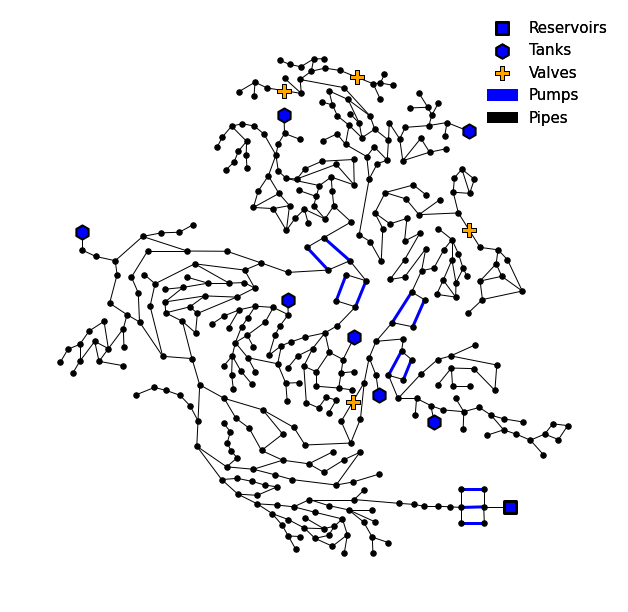
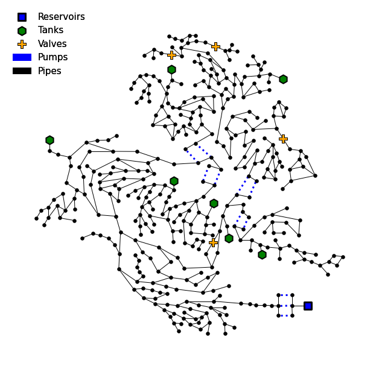
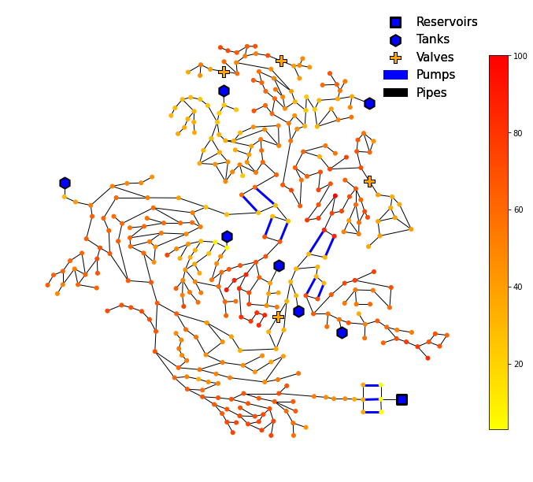
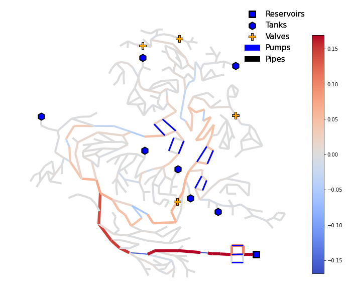
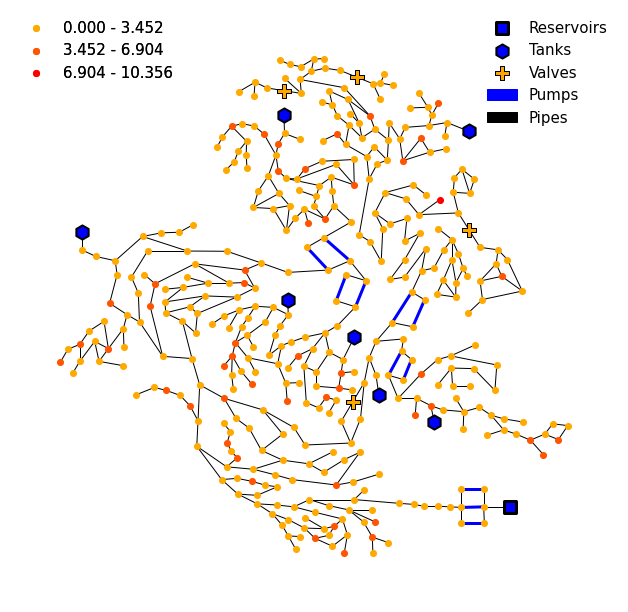
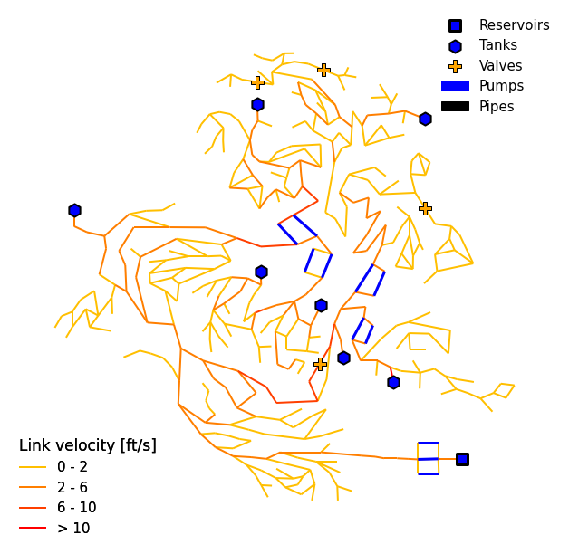
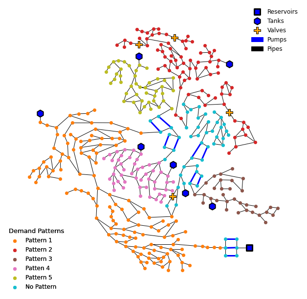

====================
Example Applications
====================

All VisWaterNet scripts should begin with the following three steps:

1.  Import the VisWaterNet and matplotlib.pyplot packages.

.. code:: python

    import viswaternet as vis
    import matplotlib.pyplot as plt
    
2. Initialize a VisWaterNet model object for the .INP file of the water distribution network. For these examples, we use the CTown network model introduced by Ostfeld et al (cite).

hyperlink

.. code:: python

    model = vis.VisWNModel("CTown.inp")
    
Alternatively, we can initialize a VisWaterNet model corresponding to a WNTR water network model object.

code, hyperlink

3. Initialize and customize a matplotlib figure and axis.

.. code:: python

    fig, ax = plt.subplots(figsize=(11,11))  
    ax.set_frame_on(False) # remove frame from figure
    
After we have initialized our VWN model object and empty matplotlib figure, we can proceed to call on different functions offered by the VisWaterNet library to generate a variety of figures. Below, we provide a series of examples to highlight the different VisWaterNet plotting functions and their wide range of inputs.

Example 1 - Basic Network Layout Plot
-----------------------------

This example demonstrates the basic plotting functionality provided by VisWaterNet. The ``plot_basic_elements`` function is used to generate a view of the network layout, depicting the locations of nodes (junctions, tanks, and reservoirs) and links (pipes, pumps, and valves).

.. code:: python

    model.plot_basic_elements(ax)

.. _basic1:

Example 2 - Customizing a Basic Network Layout Plot
-----------------------------

Here, we customize the **basic** network plot by changing the location of the legend, color of the tank marker, and pump line style.

.. code:: python

    model.plot_basic_elements(ax, legend_loc = 'upper left', 
                              tank_color = 'g', pump_line_style = ':')

.. _basic2:

All customization inputs can be found `here`_.

.. _`here`: https://viswaternet.readthedocs.io/en/latest/source/viswaternet.drawing.html#viswaternet.drawing.base.draw_base_elements

Next, Examples 3 and 4 demonstrate how to visualize data in a continuous manner, i.e., by assigning colors according to a color bar (or gradient scale).

Example 3 - Continuous Node Data Plot for Nodal Pressure
-----------------------------
 
Here, we create a **continuous** data plot for **nodal pressure at hour 10**.

.. code:: python

    model.plot_continuous_nodes(ax, parameter = "pressure", value = 10)
    
.. _basic3:

Example 4 - Continuous Data Plot for Link Flow Rate
-----------------------------

Here, we create a **continuous** data plot for mean **link flow rate** over the simulation duration. We change the color map from the default 'autumn_r' to 'coolwarm' and vary the width of the links (between :code:`min_width` and :code:`max_width`) according to the link flow rate values.

.. code:: python

    model.plot_continuous_links(ax, parameter = "flowrate", value = 'mean', cmap = 'coolwarm', min_width = 2, max_width = 6)

.. _basic4:

Next we demonstrate how to visualize data in a discete manner, i.e., by grouping data into intervals and assigning colors according to each interval shown in a legend.

Example 5 - Discrete Data Plot for Nodal Demand
-----------------------------
 
Here, we create a **discrete** data plot for **nodal demand at hour 10**. We specify that we want 3 data intervals, change the location of the discrete data legend, and modify the units of the nodal demand from the default flow units (m3/s, following SI convention) to cubic meter per hour (CMH). `This`_ is a list of the unit conversion options offered by VisWaterNet.

.. _`This`: https://viswaternet.readthedocs.io/en/latest/source/viswaternet.utils.html#module-viswaternet.utils.unit_conversion

.. code:: python

    model.plot_discrete_nodes(ax,parameter = "demand", value = 10, num_intervals = 3, legend_loc_2 = 'upper left', unit = 'CMH')
    
.. _basic5:

Example 6 - Discrete Data Plot for Link Velocity
-----------------------------

Here, we create a **discrete** data plot for **maximum link velocity** over the simulation duration. We specify the intervals we would like to see (*0-2, 2-6, 6-10*) and VisWaterNet groups all parameter data into these intervals, and constructs extra intervals (here, *<0* or *>10*) if any data points fall outside of the specified intervals. We customize the legend by specifying that the legend labels should have zero digits after the decimal point (``legend_sig_figs=0``) and providing a legend title. We also convert the units of velocity to ft/s (from the default SI units of m/s). 

.. code:: python

    model.plot_discrete_links(ax,parameter = "velocity", value = 'max', intervals = [0,2,6,10], legend_title = 'Link velocity [ft/s]', 
                          legend_sig_figs = 0, legend_loc_2 = 'lower left', unit = 'ft/s')

.. _basic6:

   
Next, we demonstrate the different functionalities offered by the ``plot_unique data`` function:
1. visualizing categorical data, i.e., specific properties of nodes or links are represented as a fixed set of categories 
2. importing and visualizing data from an excel file
3. visualizing custom data generated within the Python script
   
Example 7 - Categorical Data Plot for Nodal Demand Pattern
-----------------------------
 
Here, we create a **categorical** data plot for **nodal demand pattern**. We modify the color scheme so as to differentiate clearly between the different demand patterns and modify the legend appearance, location, and labels.

.. code:: python

    model.plot_unique_data(ax,parameter = "demand_patterns", cmap = 'tab10', 
                       legend_loc_2 = 'lower left', legend_title = 'Demand Patterns', 
                       legend_title_font_size = 13, font_size = 12,
                       interval_label_list = ['Pattern 1', 'Pattern 2', 'Pattern 3', 'Patten 4', 'Pattern 5', 'No Pattern'])

.. _basic7:

Peplacing the *parameter* value with "diameter" or "roughness" will generate categorical plots for link diameters and link roughness coefficients respectively.

Additional examples can be found in the `Examples`_ folder. The full range of inputs for each plotting function can be found in `this section`_. 

.. _`Examples`: https://github.com/tylertrimble/viswaternet/tree/master/Examples
.. _`this section`: https://viswaternet.readthedocs.io/en/latest/source/viswaternet.html#subpackages
