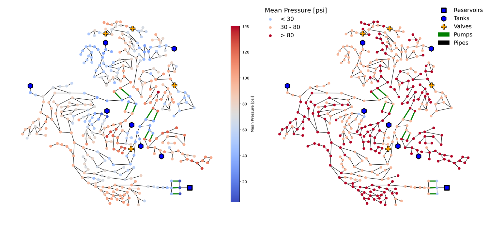
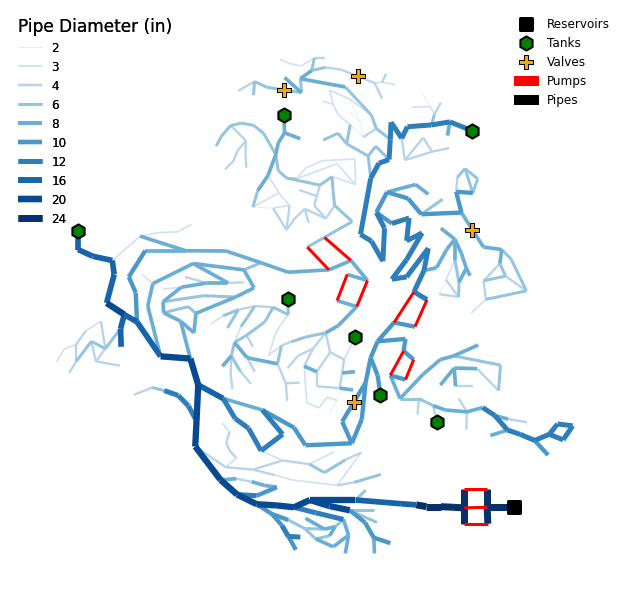

# Summary

Water distribution systems (WDSs) are complex networks and are typically represented as graphs with multiple types of nodes (e.g., junctions, reservoirs, and tanks) and links (e.g., pipes, pumps, and valves). These network elements have both static characteristics, such as pipe diameter and nodal elevation, and time-varying properties, such as pipe flow rate and nodal pressure. Researchers and practitioners working with WDSs need to model, simulate, analyze, and visualize these systems. The visualization of data over network topology can lend spatial context and a better understanding of simulation results and network properties. This paper presents `VisWaterNet`, an open-source Python package that enables easy and customizable visualization of WDS static and dynamic properties. The package allows plotting node and link data by varying element size and color in a continuous or discrete manner. `VisWaterNet` also allows plotting of categorical data, custom data generated by the user, and animations to demonstrate the change in network properties over time. 

# Statement of need

Existing open-source tools for analyzing WDSs, such as `EPANET` [@rossman2020] and the Water Network Tool for Resilience Python package (`WNTR`) [@klise2017], allow users to perform extended period simulations and analyze system hydraulic performance under a range of different conditions. However, while these tools provide basic network visualization options, they are limited in their flexibility and capabilities. `EPANET` wrappers in other programming languages also offer few plotting functions; for example, an `EPANET`-interfacing toolkit developed for MATLAB [@eliades2016] only generates network layouts, and a similar R application [arandia2018] generates basic network representations. On the other hand, popular software such as `Cytoscape` [@shannon2003] and `Graphviz` [@ellson2004] allow the easy integration of attribute data into sophisticated network plots, but it is challenging to apply them to provide meaningful results in the context of WDSs. `VisWaterNet`  was developed to provide an accessible and multifunctional approach to WDS-specific network visualization. The package is accompanied by clear documentation and code examples in order to facilitate ease of adoption, and can prove to be a helpful tool for researchers and practitioners in the domain of WDS analysis. Users are welcome to further develop, improve and extend these open-source scripts.

# Functionality

`VisWaterNet` extracts WDS characteristics and simulation results from a standardized user-provided input file, i.e., `EPANET` .INP file [@rossman2020], using `WNTR` [@klise2017], and then constructs a `NetworkX` [@hagberg2008] graph on a `Matplotlib` [@hunter2007] figure axis. The hydraulic simulation results are based on the `EPANET 2.2` [@rossman2020] hydraulic engine. The main plotting functions offered by `VisWaterNet` include:

1.	Continuous plotting - users can choose to represent numerical data in a *continuous* manner, i.e., by assigning  nodes or links colors chosen from a color gradient scale. \autoref{fig:fig1} (left) shows an example of a continuous plot of mean nodal pressure data for network CTown [@ostfeld2012] generated by `VisWaterNet`.

2.	Discrete plotting - users can plot numerical data in a *discrete* manner, i.e., the data is grouped into intervals and each interval is assigned a single color from a selected color palette. \autoref{fig:fig1} (right) shows an example of a discrete plot  generated for the same nodal pressure data shown in \autoref{fig:fig1} (left).
 
3.	Categorical plotting - categorical data, i.e., a property of each node or link that belongs to a fixed set of categories, can also be plotted. This functionality is useful in visualizing node or link attributes that are represented as strings, such as nodal demand pattern names or pipe material, or for numerical attributes that typically take on only a discrete set of values, such as pipe diameter. \autoref{fig:fig2} shows an example of a categorical data plot depicting link diameters in the CTown network.
 

Additionally, `VisWaterNet` can perform the following functions:

1.	Import and visualize custom data generated either in Python scripts or in Excel files.
2.	Add a second dimension of information to a plot by customizing node markers/sizes and link styles/widths.
3.	Convert units (e.g., a user can choose to represent length data in units of *m*, *cm*, *ft*, or *in*).
4.	Represent simulation results at a specified time step or summarized throughout the duration (e.g., a user can choose to visualize minimum, maximum, or mean pressure, or pressure at a particular time step).
5.	Customize the number of intervals or width of intervals for discrete data plots, and hide intervals with no data points.
6.	Customize the appearance of specific nodes and links.
7.	Add text labels to specific nodes and links.

VisWaterNet is a practical tool to aid WDS analyses and visualization. Example applications include visualizing different demand areas and pressure zones, highlighting the critical locations in the system, tracking water quality, and visualizing multiple statistics including continuous and categorical values. VisWaterNet scripts are under continuous development and can be further extended and improved by users and developers for specific applications.

# Acknowledgements

This work was supported by the National Science Foundation under grants 1943428 and 1953206. We would like to thank Matthew Frankel, Gregory Hendrickson, ‪Gerardo Riaño-Briceño‬, and Erik Vosburgh for testing the package and providing valuable feedback.

# References
